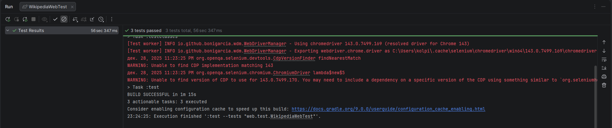
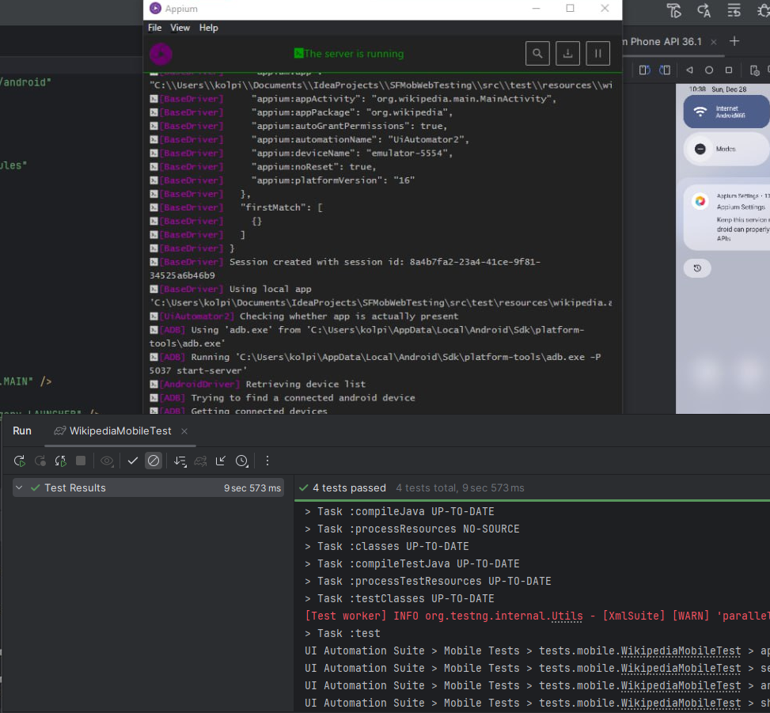

# Проект с автоматизированными UI‑тестами для:
- **веб‑версии** сайта **ru.wikipedia.org**
- **мобильного приложения Wikipedia для Android**
  Тесты покрывают базовые пользовательские сценарии: запуск, навигацию, поиск и проверку ключевых экранов.
## Стек технологий
- **Java 11+**
- **Selenium WebDriver**
- **Appium**(UiAutomator2)
- **TestNG**
- **Maven**
- **WebDriverManager**
- **Appium Java Client**
## Для веб‑тестов
- Google Chrome
- Доступ к: https://ru.wikipedia.org

## Для мобильных тестов
- **Node.js + Appium**

  `npm install -g appium appium driver install uiautomator2`

- **Android Studio / Android SDK**
- Android‑эмулятор (рекомендуется **API 30+**, допускается **API 16**)
- Приложение **Wikipedia**, установленное на эмуляторе или устройстве

